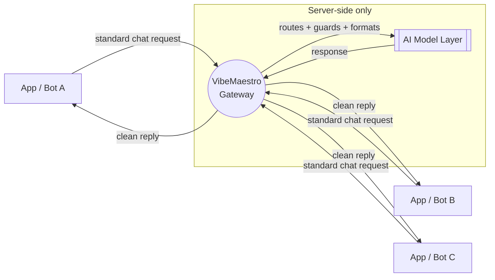

# VibeMaestro

> **Your apps, orchestrated. One conductor for a whole ecosystem of AI-native tools.**

  
  
  
  

**Live:** [vibemaestro.app](https://vibemaestro.app)

Built and maintained by **[VPDLNY](https://github.com/vpdlny)**.

---

> ### 🚧 Code coming soon
> VibeMaestro is under active development. This repository is the public home for the
> project — architecture, philosophy, and roadmap live here today. **The full source
> will be published here, open, once the core stabilizes.** No black boxes. No lock-in.
> When it ships, you'll be able to read every line.

---

## What it is

VibeMaestro is a **conductor for AI-native apps** — a single orchestration layer that lets a
fleet of small, focused tools talk to one shared intelligence gateway instead of each
reinventing the wheel.

- 🎼 **One gateway, many apps** — every tool speaks to a single, consistent AI layer
- 🤖 **Model-agnostic** — the gateway abstracts the model behind a stable, standard chat interface
- 🔌 **Plug-in bots** — new apps join the ecosystem by connecting to the gateway, not by re-embedding keys or logic
- 🛡️ **Secrets stay server-side** — apps never hold raw model credentials; the gateway does
- ⚡ **Edge-first** — built to run on Cloudflare's global network for low-latency responses everywhere

## What it isn't

- ❌ Not another chatbot wrapper
- ❌ Not a walled garden — it's going fully open source
- ❌ Not tied to a single model vendor
- ❌ Not a data-harvesting funnel

## Why we're building it

Every new AI app tends to re-implement the same plumbing: model calls, auth, retries,
formatting, rate limits. That's wasted effort and a security liability — keys end up
scattered across a dozen codebases.

VibeMaestro centralizes the hard parts into one well-guarded conductor, so each app can
stay small, safe, and focused on what it actually does. Build the app; let the maestro
handle the orchestra.

---

## How it works (high level)

1. **Apps send a standard chat request** to the gateway — no model keys, no vendor-specific glue.
2. **The gateway authenticates the app**, applies guards (rate limits, safety, formatting), and routes the request to the appropriate model.
3. **The model responds**, the gateway normalizes the output, and hands each app back a clean, predictable reply.
4. **Credentials never leave the server.** Apps only ever hold a scoped connection to the maestro.

See [`docs/ARCHITECTURE.md`](docs/ARCHITECTURE.md) for the conceptual design.

---

## Roadmap

- [x] Core gateway design
- [x] Standard chat interface contract
- [ ] Multi-app orchestration layer *(in progress — Bumboclaat build)*
- [ ] Admin console + observability
- [ ] Public open-source release of the full source 🎯
- [ ] Self-host guide + one-click deploy template

---

## Philosophy

VibeMaestro is part of the **VPDLNY** mission — free, independent, open tooling with no VC,
no boss, no strings. When the code lands here, it lands in the open.

  Built by <a href="https://osintnet.uk">Indica Independent</a> · <a href="https://github.com/vpdlny">VPDLNY</a> · info is the weapon ⚔️

