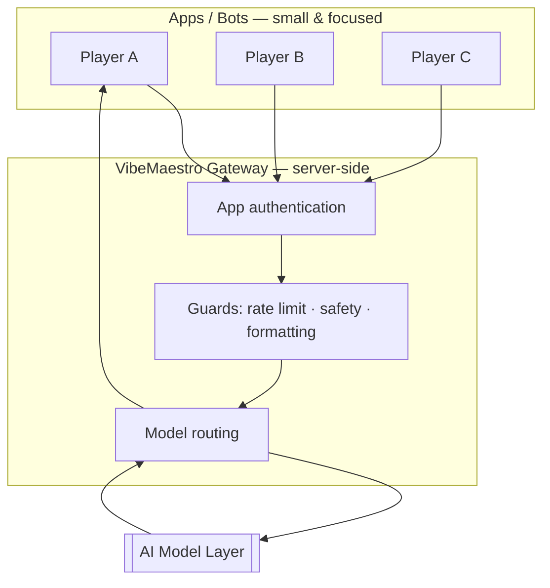

# VibeMaestro — Architecture (Conceptual)

> This document describes the **design philosophy** of VibeMaestro at a high level.
> Implementation details, routes, and configuration will accompany the source when it is
> published. Nothing here is a live endpoint or credential.

---

## The problem

AI-native apps multiply fast. Each one typically re-implements:

- model API calls and retries
- credential storage
- request/response formatting
- rate limiting and abuse guards
- logging and observability

Duplicating this per-app is slow to build, hard to maintain, and — worst of all —
scatters sensitive credentials across many codebases.

## The idea: one conductor

VibeMaestro introduces a single **gateway** (the "conductor") that owns all of the shared
plumbing. Individual apps (the "players") stay small and focused. They don't hold model
keys or vendor logic — they simply make a request to the conductor and receive a clean
reply.

## Core principles

### 1. A single, standard chat contract
Apps speak one consistent request/response shape to the gateway. Because the interface is
standardized around a widely-used chat format, apps written against it don't need to change
when the model behind the gateway changes.

### 2. Credentials never leave the server
The gateway is the only component that holds model credentials. Apps authenticate to the
gateway with their own scoped connection. If an app is ever compromised, no model keys are
exposed.

### 3. Model-agnostic by design
The routing layer decides which model serves a given request. Swapping or upgrading models
is a gateway-side change — the players never notice.

### 4. Guarded by default
Rate limiting, safety checks, and output normalization live in the conductor, so every app
inherits them automatically instead of implementing them (inconsistently) on its own.

### 5. Edge-first
The gateway is designed to run on a global edge network, keeping latency low for users
anywhere in the world.

## What lives where

| Concern | Owner |
|---|---|
| Model credentials | Gateway (server-side only) |
| Model selection / routing | Gateway |
| Rate limiting & safety guards | Gateway |
| Response formatting | Gateway |
| App-specific behavior & UX | Individual app |
| App ↔ gateway authentication | Scoped connection per app |

## Status

The orchestration layer is being built now. Once it stabilizes, the full implementation —
gateway, contract, and reference players — will be published in this repository, open
source, for anyone to read, run, and self-host.

---

Part of the <a href="https://github.com/vpdlny">VPDLNY</a> open-tools mission.
